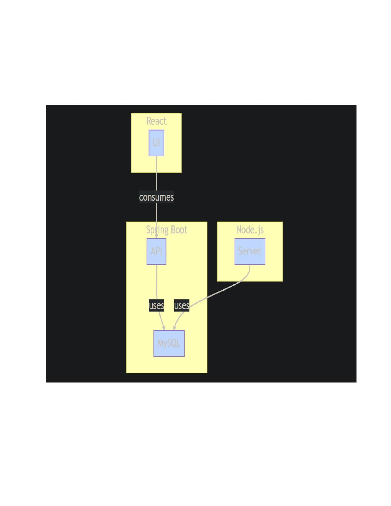

# Student Management

# project-documentation

  

<h3 align="center">Student Management</h3>
This is a simple web application for managing student information. It allows you to:

---

- Add, edit, and delete student records
- View a list of all students

## 📝 Table of Contents
- [About](#about)
- [Getting Started](#getting_started)
- [Deployment](#deployment)
- [Usage](#usage)
- [Flow Chart](#flowchart)
- [TODO](../TODO.md)
- [Contributing](../CONTRIBUTING.md)
- [Authors](#authors)
- [Acknowledgments](#acknowledgement)

## 🧐 About 
This application is built using the following technologies:

- React
- Node.js
- Spring Boot
- MySQL

## 🏁 Getting Started 
The Student Management System is a web-based application that helps educational institutions manage their student records. This system provides a platform for students, teachers, and administrators to interact and manage data in a secure and efficient manner. In this we will be deploying the Student Management System using MySQL, Spring Boot, React, and Node.js.
### Prerequisites
Before we begin, make sure you have the following software installed on your computer:

- MySQL Server
- Spring Boot CLI
- Node.js and npm
- React

---
### Set up your environment:
Ensure that your development environment is properly configured for each of the technologies you'll be using. This includes installing MySQL, Node.js, and any necessary dependencies for React and Spring Boot.

### Build your backend: 
Start by building your backend with Spring Boot and MySQL. Define your data schema, create your API endpoints, and test them to ensure they're functioning correctly.

### Build your frontend: 
Next, build your frontend with React and Node.js. Create your components and define your UI, making sure to connect to your backend APIs.

### Test locally: 
Test your application locally to make sure everything is working as expected. This involves running both your frontend and backend, making sure they're properly communicating with each other.

---

### Installing 
Install MySQL: 
- You can download and install MySQL from the official website. Follow the instructions for your operating system to complete the installation process.

Create a database: 
- Once MySQL is installed, create a database for your student management system. You can use the MySQL command-line interface or a GUI tool like MySQL Workbench to create a new database.

Install Spring Boot: 
- You can download and install Spring Boot from the official website. Follow the instructions for your operating system to complete the installation process.

Create a Spring Boot project:
-  Create a new Spring Boot project using your favorite IDE or the Spring Boot CLI. You can use the Spring Initializr to create a basic project structure with the necessary dependencies.

Connect to MySQL: 
- Configure your Spring Boot application to connect to the MySQL database you created earlier. You can use the Spring Data JPA to handle the database connectivity and it can be tested using Postman.

Install Node.js: 
- You can download and install Node.js from the official website. Follow the instructions for your operating system to complete the installation process.

Install React:
-  Once Node.js is installed, you can use the Node Package Manager (npm) to install React. Open your terminal or command prompt and run the following command: npm install react

Create a React project: 
- Create a new React project using your favorite IDE or the Create React App CLI. You can use the npx create-react-app command to create a basic project structure with the necessary dependencies.

Connect to Spring Boot:
-  Configure your React application to connect to the Spring Boot application you created earlier. You can use the fetch API or a library like Axios to make HTTP requests to the Spring Boot REST API.

## 🔧 Running the tests 
---
Start both the Spring Boot and React applications and test the student management system. You can run the file as a java application to start the Spring Boot application and the npm start command to start the React application to ensure that your component is working correctly.
---

## 🎈 Usage 
---
A Student Management System (SMS) is an application that allows educational institutions to manage and organize their student-related data. The system can store information about students, courses, grades, attendance, and more. In this we will discuss the usage of a Student Management System built using MySQL, Spring Boot, React, and Node.js.

Here's a brief overview of how these technologies can be used to build a Student Management System:

Database Design: 
-  The first step in building a Student Management System is to design the database schema. You can use MySQL Workbench to create a database schema that will store information about students, courses, grades, attendance, and more.

Backend Development: 
-  Once the database schema is designed, you can use Spring Boot to create a RESTful API that will handle CRUD (Create, Read, Update, Delete) operations on the database. The API can be built using Java and Spring Boot, and it can be tested using Postman.

Frontend Development:
-   After the API is built, you can use React to create a user interface that will interact with the API. You can create forms for adding new students, courses, and grades, as well as tables for displaying the data.

Integration: 
-  Finally, you can use Node.js to integrate the backend API with the frontend UI. Node.js can be used to serve the React application and communicate with the Spring Boot API.
---
By using these technologies, you can create a robust and scalable Student Management System that can handle the needs of educational institutions of any size. With MySQL for the database, Spring Boot for the backend, React for the frontend, and Node.js for integration, you can create a powerful system that will help educational institutions manage their student data with ease.

## ⛏️ Flow Chart 

- [MongoDB](https://www.mongodb.com/) - Database
- [Express](https://expressjs.com/) - Server Framework
- [VueJs](https://vuejs.org/) - Web Framework
- [NodeJs](https://nodejs.org/en/) - Server Environment

## ✍️ Contributing 
If you would like to contribute to this project, please follow these guidelines:

- Fork the repository
- Create a new branch for your feature or bug fix
- Make your changes and commit them to your branch
- Push your changes to your forked repository
- Submit a pull request to the main repository

## 🎉 Acknowledgements 
- [React](https://react.dev/)
- [MySQL](https://dev.mysql.com/doc/)
- [Spring Boot](https://spring.io/) & [Spring Tool Suit](https://spring.io/tools)
- [NodeJS](https://nodejs.org/en/docs)